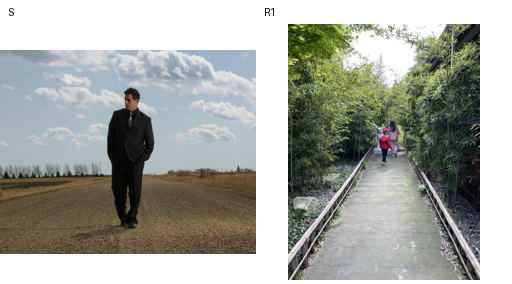
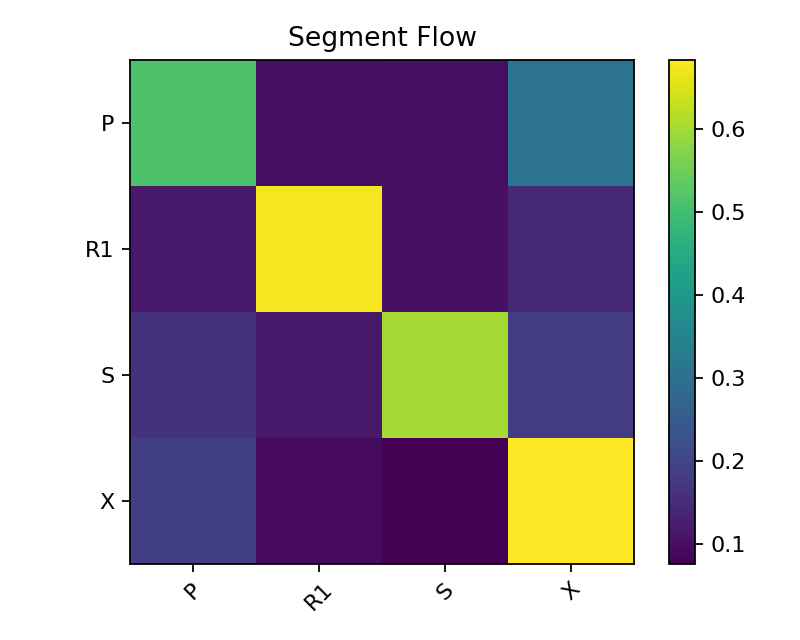
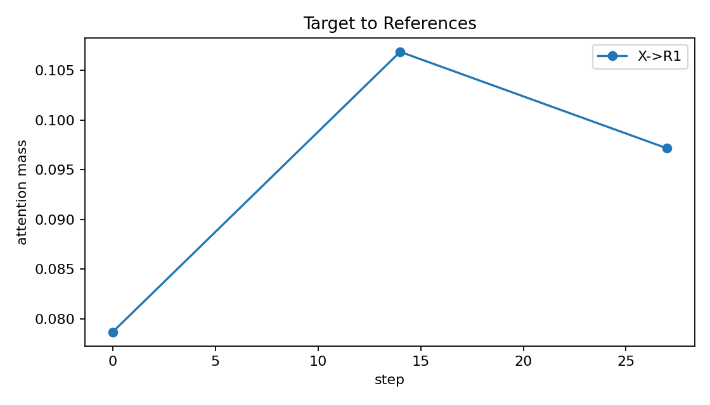
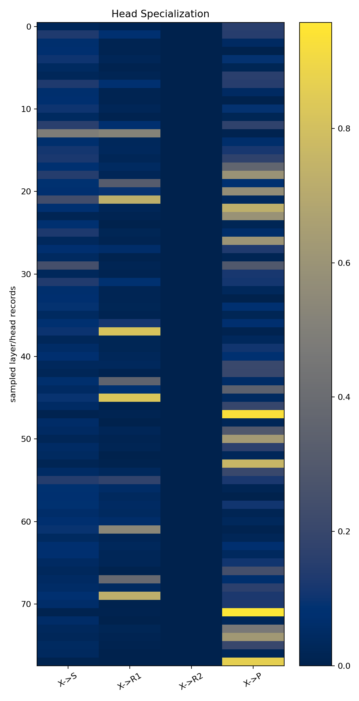
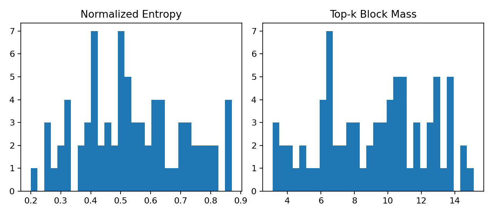
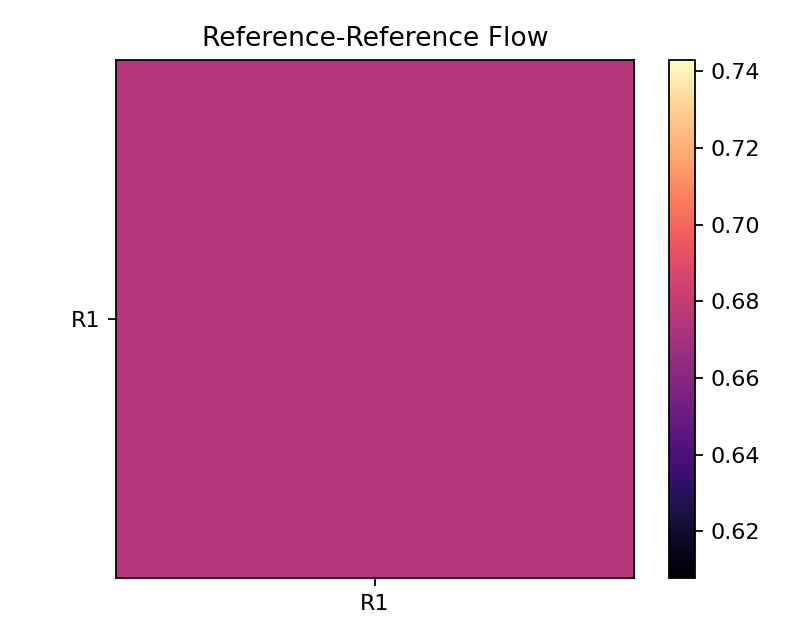

# FLUX.2 Klein 单 Source + 单 Ref 推理机制分析

> 数据来源：
> - smoke: `/home/ma-user/work/algorithm/algorithm_lyr/results/smoke_background`
> - mechanism light: `/home/ag/projects_anguo/results/attention_i2i/mechanism_single_ref_light`
>
> 任务：source + 1 reference，prompt 为 `Change the background of the first image to that of the second image.`
>
> 目标：先在 full attention teacher 下研究 FLUX.2-klein-4B 如何使用 noisy target、source image、reference image 和 prompt tokens。当前不是训练，不做 sparse attention，也不先做多参考消融。

---

## 1. 结论摘要

| 问题 | 当前结论 | 证据 |
|---|---|---|
| pipeline / NPU / hook 是否打通 | 已打通 | `load_errors=[]`，25 个 attention module 注册，`attention_blocks.jsonl` 生成 |
| token 分段是否可靠 | 可靠 | 自动推断 `[P, X, S, R1]`，总长 12621 |
| target 是否直接读取 reference | 是，但高度集中在少数 layer/head | 全局 `X->R1=0.093`，但最高 head 到 `0.828` |
| source preservation 是否存在 | 是，主要表现为高 `X->X` 与部分 early `X->S` head | 全局 `X->X=0.684`，`X->S=0.076`；step0 layer4 head4 `X->S=0.488` |
| prompt 是否全程重要 | 是，且 single-stream 中后层很强 | 全局 `X->P=0.190`；layer14 `X->P=0.337`，layer24 `X->P=0.291` |
| source/ref 是否直接融合 | 是，尤其最后 single block | 全局 `S->R1=0.116`、`R1->S=0.101`；layer24 分别 `0.178/0.178` |
| attention 是否天然稀疏 | 是，head/layer 差异明显 | token normalized entropy 均值 `0.540`，最低 `0.200`；Gini 均值 `0.835` |
| 多参考 reference-reference | 当前不能回答 | 只有 `R1`，还没有 `R1<->R2` |
| low/high resolution 一致性 | 当前不能回答 | 只跑了 1024 max_size auto-fit |
| ref ablation / hidden deviation | 当前不能回答 | 只做 diagnostic full-attention probe |

一句话结论：

> 在单 source + 单 ref 的 background-change 任务中，FLUX.2 Klein 并不是均匀地把 reference 注入 target。绝大多数 token 仍以自段注意为主，但少数 layer/head 承担很强的跨段路由：layer4/head4 和 layer14/head12 是最明显的 `X->R1` reference-transfer head，layer14/24 的若干 head 强烈保留 `X->P` prompt 约束，layer24 则出现明显 `S<->R1` 与 `S/R1->X` 融合/回写。

### 1.1 关键可视化

以下图片已经从轻量实验结果目录复制到代码仓内，路径为 `flux2_attention_probe/analysis_assets/mechanism_single_ref_light/`，可以随 `analysis.md` 一起提交到 GitHub。

输入 source/ref 与最终生成图：




Segment flow 总览。该图用于快速判断 `P/X/S/R1` 四段之间的主方向：自段注意仍占主导，但 `X->P`、`X->R1`、`S->R1`、`R1->X` 都有可观质量，说明 reference/prompt/source 都进入了 target 更新路径。



`X->R1` 随 timestep 的变化。当前 light run 只采样 step 0/14/27，因此更像机制定位而非连续曲线；趋势上中期 `X->R1` 更强，后期 `R1->X` 回写增强。



Head specialization。后续 sparse routing 不应该用统一阈值，而应优先保留强专精 head，例如 `layer14/head12` 的 `X->R1`、`layer14/head20` 的 `X->P`、`layer24/head8` 的 `S<->R1`。



Entropy / top-k / Gini 分布。Layer/head 差异明显，说明 full attention teacher 中确实存在天然稀疏结构，但最后层的融合性质更强，不能简单按 top-k 一刀切。



当前是单 reference，所以 reference-reference 图只能体现 `S<->R1` / conditioning token 交互，不能回答 `R1<->R2` 多参考污染问题。



---

## 2. 实验配置与运行稳定性

### 2.1 机制 light 配置

`probe_registration.json`：

```yaml
save_full_attention: false
save_block_attention: true
block_size: 256
sample_layers: [0, 4, 14, 24]
sample_heads: [0, 4, 8, 12, 16, 20]
sample_steps: [0, 14, 27]
max_query_tokens_per_record: 12621
```

layer id 对应关系：

- `0, 4`: double-stream blocks，即 `transformer_blocks.0/4.attn`
- `14`: single-stream 中段，即 `single_transformer_blocks.9.attn`
- `24`: single-stream 最后一层，即 `single_transformer_blocks.19.attn`

理论采样点是 `4 layers x 6 heads x 3 steps = 72`。实测 `distribution_rows=78`、`attention_blocks.jsonl` 有 13 条 block records，多出的 6 条来自 step 0 的额外 forward/prefill 行为，和 smoke 中的重复 step0 现象一致。

### 2.2 尺寸、性能、显存

`effective_run.json`：

```json
{
  "first_image_size": [2571, 2048],
  "rule": "scale_down_to_max_size",
  "scale": 0.4462558703569987,
  "height_out": 912,
  "width_out": 1136,
  "max_size": 1024
}
```

`timing_report.json` / `memory_report.json`：

```json
{
  "elapsed_sec": 282.90,
  "steps": 28,
  "max_memory_allocated": 17876129280,
  "oom": false,
  "warnings": []
}
```

关键点：

- 运行无 OOM，峰值约 `17.9 GB`，和 smoke 基本一致。
- wall time 从 smoke 的约 `68.5s` 增加到 `282.9s`，主要开销来自 sampled step 的显式 QK/softmax/block summary。
- 日志中 step 0、14、27 明显变慢，符合 `sample_steps=[0,14,27]` 的预期；其他 step 仍接近正常推理速度。

---

## 3. Token 布局确认

`segment_map.json`：

| 段 | 范围 | 长度 | 含义 |
|---|---:|---:|---|
| `P` | `[0, 512)` | 512 | prompt/text tokens |
| `X` | `[512, 4559)` | 4047 | noisy target latent tokens |
| `S` | `[4559, 8606)` | 4047 | source image tokens |
| `R1` | `[8606, 12621)` | 4015 | reference image tokens |

shape tail 中每个 denoising step 保持：

- `hidden_states_shape = [1, 12109, 128]`
- `encoder_hidden_states_shape = [1, 512, 7680]`
- `img_ids_shape = [1, 12109, 4]`
- `txt_ids_shape = [1, 512, 4]`

这说明序列布局在整条 denoising trajectory 中稳定，没有动态裁剪 token。`max_query_tokens_per_record=12621` 覆盖完整 `[P, X, S, R1]` query，所以这次 light run 能回答 `X->S / X->R1 / X->P`。

---

## 4. Segment-Level 信息流

### 4.1 全局平均 flow

从 `attention_blocks.jsonl` 直接聚合得到的平均 segment mass：

| Edge | Mean mass | 解释 |
|---|---:|---|
| `X->X` | 0.684 | target 大部分 attention 留在自身段 |
| `R1->R1` | 0.675 | reference 自保持很强 |
| `S->S` | 0.602 | source 自保持强 |
| `P->P` | 0.513 | prompt 自保持中等 |
| `P->X` | 0.307 | prompt 向 target 注入语义 |
| `X->P` | 0.190 | target 主动读 prompt，且不只发生早期 |
| `S->X` | 0.182 | source 对 target 有明显回写/对齐 |
| `S->P` | 0.165 | source 读 prompt |
| `R1->X` | 0.147 | reference 对 target 有回写 |
| `R1->P` | 0.117 | reference 读 prompt |
| `S->R1` | 0.116 | source 读 reference |
| `R1->S` | 0.101 | reference 读 source |
| `P->S` | 0.101 | prompt 读 source |
| `P->R1` | 0.099 | prompt 读 reference |
| `X->R1` | 0.093 | target 直接读 reference |
| `X->S` | 0.076 | target 直接读 source |

两个核心判断：

1. `X->R1` 的全局均值不高，但存在极强 head；它不是全层均匀机制，而是 head-specialized routing。
2. `X->P` 全局高于 `X->R1` 和 `X->S`，说明 prompt/text 在编辑过程中不是只做 early conditioning，而是在 sampled 中后层仍参与 target 更新。

### 4.2 timestep 维度

| Step | `X->S` | `X->R1` | `X->P` | `S->R1` | `R1->S` | `R1->X` |
|---:|---:|---:|---:|---:|---:|---:|
| 0 | 0.106 | 0.079 | 0.186 | 0.096 | 0.118 | 0.126 |
| 14 | 0.056 | 0.107 | 0.190 | 0.122 | 0.091 | 0.135 |
| 27 | 0.059 | 0.097 | 0.194 | 0.136 | 0.091 | 0.183 |

机制解读：

- `X->S` 从 step0 的 `0.106` 降到中后期约 `0.056-0.059`，source preservation 更偏早期。
- `X->R1` 从 step0 的 `0.079` 上升到 step14 的 `0.107`，说明 reference transfer 在中期更强。
- `X->P` 从 `0.186` 到 `0.194` 基本不降，prompt influence 持续存在。
- `R1->X` 到 step27 升到 `0.183`，说明后期 reference 对 target 的回写增强。
- `S->R1` 随 step 增强，可能表示 source/ref 的背景或风格相关信息在后期融合。

### 4.3 layer 维度

| Layer | `X->S` | `X->R1` | `X->P` | `S->R1` | `R1->S` | `S->X` | `R1->X` |
|---:|---:|---:|---:|---:|---:|---:|---:|
| 0 | 0.077 | 0.037 | 0.074 | 0.080 | 0.099 | 0.162 | 0.102 |
| 4 | 0.100 | 0.137 | 0.095 | 0.082 | 0.076 | 0.082 | 0.055 |
| 14 | 0.068 | 0.204 | 0.337 | 0.137 | 0.053 | 0.164 | 0.120 |
| 24 | 0.059 | 0.013 | 0.291 | 0.178 | 0.178 | 0.326 | 0.325 |

机制解读：

- **Layer 0**：`P->X=0.463` 很强，早期 double-stream 主要负责 prompt 向 target 注入；`X->R1=0.037` 很弱。
- **Layer 4**：`X->R1=0.137`、`X->S=0.100`，double-stream 末层开始出现 target 对 source/ref 的直接读取。
- **Layer 14**：`X->R1=0.204` 和 `X->P=0.337` 同时高，是最关键的 single-stream reference-transfer + prompt-control 层。
- **Layer 24**：`X->R1=0.013` 几乎关闭，但 `S->R1=0.178`、`R1->S=0.178`、`S->X=0.326`、`R1->X=0.325` 很强。最后层更像是 source/reference 之间做融合，然后共同回写 target，而不是 target 直接读取 R1。

---

## 5. Head Specialization

### 5.1 Target 直接读取 reference：`X->R1`

最高的 `X->R1` head：

| Step | Layer | Head | `X->R1` |
|---:|---:|---:|---:|
| 14 | 14 | 12 | 0.828 |
| 14 | 4 | 4 | 0.817 |
| 0 | 14 | 12 | 0.728 |
| 27 | 14 | 12 | 0.727 |
| 27 | 4 | 4 | 0.539 |
| 0 | 4 | 4 | 0.517 |

结论：

- `layer14/head12` 是最稳定、最强的 target-to-reference head，三个 sampled steps 都很高。
- `layer4/head4` 是 double-stream 末层的强 reference-transfer head，在 step14 达到 `0.817`。
- 因为全局 `X->R1` 均值只有 `0.093`，这些 head 是强专精而不是普遍行为。

### 5.2 Source preservation：`X->S`

最高的 `X->S` head：

| Step | Layer | Head | `X->S` |
|---:|---:|---:|---:|
| 0 | 4 | 4 | 0.488 |
| 0 | 24 | 20 | 0.250 |
| 0 | 14 | 12 | 0.237 |
| 0 | 4 | 0 | 0.161 |

结论：

- `X->S` 的强峰主要出现在 step0，符合“先锁定 source 结构，再逐步引入 ref”的机制假设。
- `layer4/head4` 同时是强 `X->S` 和强 `X->R1` head，可能承担 source/ref 对齐或局部编辑区域绑定。

### 5.3 Prompt control：`X->P`

最高的 `X->P` head：

| Step | Layer | Head | `X->P` |
|---:|---:|---:|---:|
| 27 | 14 | 20 | 0.958 |
| 14 | 14 | 20 | 0.928 |
| 27 | 24 | 20 | 0.867 |
| 14 | 24 | 20 | 0.761 |
| 0 | 14 | 16 | 0.729 |

结论：

- prompt 不是只在 early denoising 起作用。`layer14/head20` 在 step14/27 几乎专门读 prompt。
- 对 background-change 任务，这可能是保持“只改背景”指令约束的关键 head。

### 5.4 Source/Reference 融合与回写

最高 cross edges：

- `S->R1`: layer24/head8 在 step0/14 分别约 `0.462/0.463`
- `R1->S`: layer24/head8 在 step14 约 `0.338`
- `S->X`: layer24/head20 在 step14 约 `0.682`
- `R1->X`: layer24/head12 在 step27 约 `0.697`

结论：

- 最后一层 single-stream 是明显的 fusion/writeback 层。
- 这对后续 ablation 很关键：如果只 block `X->R1`，可能不能完全去掉 reference 影响，因为 `R1->S`、`R1->X`、`S->R1->X` 仍然可能传递 reference 信息。

---

## 6. Attention Distribution / 稀疏性

整体 distribution：

| Metric | Mean | Min | Max |
|---|---:|---:|---:|
| normalized token entropy | 0.540 | 0.200 | 0.870 |
| top16 block mass | 9.188 | 3.118 | 15.127 |
| normalized block entropy | 0.762 | 0.607 | 0.908 |
| Gini blocks | 0.835 | 0.559 | 0.955 |

按 step：

| Step | Entropy | Top16 | Gini |
|---:|---:|---:|---:|
| 0 | 0.567 | 8.881 | 0.835 |
| 14 | 0.537 | 9.329 | 0.834 |
| 27 | 0.511 | 9.429 | 0.837 |

按 layer：

| Layer | Entropy | Top16 | Gini |
|---:|---:|---:|---:|
| 0 | 0.563 | 8.238 | 0.855 |
| 4 | 0.417 | 10.990 | 0.924 |
| 14 | 0.573 | 8.937 | 0.809 |
| 24 | 0.600 | 8.902 | 0.745 |

最低 entropy / 最稀疏的 head：

| Step | Layer | Head | Entropy | Top16 | Gini |
|---:|---:|---:|---:|---:|---:|
| 27 | 0 | 20 | 0.200 | 10.830 | 0.938 |
| 27 | 4 | 8 | 0.246 | 10.880 | 0.952 |
| 14 | 0 | 20 | 0.249 | 11.038 | 0.947 |
| 27 | 4 | 12 | 0.285 | 13.893 | 0.954 |

机制判断：

- Attention 并不均匀，尤其 layer4 很稀疏：entropy 最低、top16 和 Gini 最高。
- 这支持后续做 sparse routing / reliability map，但必须 head/layer/step 条件化，不能用统一阈值。
- Layer24 的 Gini 较低但跨段 flow 强，说明最后层可能更像全局融合/回写，不适合简单按 top-k sparse 裁剪。

---

## 7. 对研究目标的逐项回答

### 7.1 Full attention 下的信息流

已能回答单 ref 场景：

- target/noisy tokens 直接 attend 到 reference：存在，`X->R1` 全局 `0.093`，强 head 最高 `0.828`。
- source tokens 使用阶段：`X->S` 在 step0 更高，source preservation 偏早期；layer24 的 `S->X` 后期也强，说明 source 也参与最终回写。
- prompt tokens 是否重要：重要，`X->P` 全局 `0.190`，layer14/head20 在 step14/27 接近 prompt-specialized。
- source/reference 融合：存在，`S->R1`、`R1->S` 在 layer24 明显升高。

尚不能回答：

- `R1->R2` / `R2->R1` 多参考互相融合，因为当前只有一个 reference。

### 7.2 layer/head/timestep 分工

已观察到明显分工：

- layer0：prompt 写入 target，`P->X` 强。
- layer4：double-stream 末层有稀疏强 head，`head4` 同时强 `X->S` 与 `X->R1`。
- layer14：reference transfer 和 prompt control 最强，`head12` 读 R1，`head20` 读 P。
- layer24：source/ref 融合与对 target 回写最强，直接 `X->R1` 反而很低。

### 7.3 多参考图之间 attention map

当前单 ref 只能看 `S<->R1`，不能看 `R1<->R2`。但 `S<->R1` 已经说明 conditioning image tokens 之间会直接交互，后续多 ref 时必须重点检查 `R_i->R_j` 是否导致 reference contamination。

### 7.4 高低分辨率一致性

当前没有 low/high 对照。下一步需要用相同 source/ref/prompt/seed 跑：

- low: max_size 512 或 768
- high: max_size 1024

然后比较：

- segment-level `X->R1`、`X->S`、`X->P` correlation
- block top-k overlap / Jaccard
- JS divergence
- reference binding consistency

### 7.5 Reliability feature 候选

| Feature | 当前证据 | 是否适合 |
|---|---|---|
| dense attention top-k useful edges | 强 head 很集中，如 `layer14/head12 X->R1`、`layer14/head20 X->P` | 适合，但要按 layer/head/step 条件化 |
| ref-block ablation hidden/output impact | 当前未跑 ablation | 暂不能判断 |
| low/high block edge agreement | 当前未跑 low/high | 暂不能判断 |
| seed stability | 当前只 seed0 | 暂不能判断 |
| segment mass profile | `X->R1`、`X->P`、`S<->R1` 有清晰层间差异 | 适合作为 coarse reliability feature |
| entropy/Gini/top-k | layer4 稀疏性强，layer24 更融合 | 适合辅助判断是否可 sparse，但不能单独决定保留边 |

---

## 8. 对后续实验的建议

### 8.1 先扩单 ref，不要直接 all heads 全量

当前 light 配置已足够定位机制。下一步建议有控制地扩：

```yaml
sample_layers: [0, 2, 4, 9, 14, 19, 24]
sample_heads: [0, 4, 8, 12, 16, 20]
sample_steps: [0, 7, 14, 21, 27]
block_size: 256
max_query_tokens_per_record: 12621
```

暂时不要回到 `sample_heads: all + block_size: 128 + 9 layers`，step0 会非常慢。

### 8.1.1 重型验证：每层、每个 timestep

如果要做你说的“重量化验证”，即每一层、每一个 timestep 都验证，并且保留所有 head 与完整 `[P, X, S, R1]` query 序列，直接使用新增配置：

```bash
cd /home/ag/projects_anguo/diffusers/flux2_attention_probe

ASCEND_VISIBLE_DEVICES=2 \
PYTHONPATH=$PWD/../src \
HF_HUB_OFFLINE=1 TRANSFORMERS_OFFLINE=1 HF_DATASETS_OFFLINE=1 \
python3 scripts/run_probe.py \
  --config configs/probe_mechanism_heavy.yaml \
  --source "$SOURCE_IMAGE" \
  --refs "$REFERENCE_IMAGE" \
  --prompt "Change the background of the first image to that of the second image." \
  --num_inference_steps 28 \
  --seed 0 \
  --backend npu \
  --output_dir /home/ag/projects_anguo/results/attention_i2i/mechanism_single_ref_heavy
```

这个配置的关键字段是：

```yaml
probe:
  save_full_attention: false
  save_block_attention: true
  block_size: 256
  sample_layers: all
  sample_heads: all
  sample_steps: all
  max_query_tokens_per_record: all
generation:
  max_size: 1024
  num_inference_steps: 28
```

预期覆盖：

- 25 个 attention module：`5` 个 double-stream + `20` 个 single-stream。
- 28 个 denoising timesteps。
- 24 个 heads。
- 完整 query/key 序列，所以会统计 `P->*`、`X->*`、`S->*`、`R1->*` 所有方向。
- 理论主记录规模约 `25 layers x 28 steps = 700` 条 block records；如果 pipeline 有额外 prefill/重复 step0，会略多。

预期成本与风险：

- 这是 full teacher 的重型统计，不保存完整 `N x N` attention，只保存 block summary。
- 在当前 912x1136 auto-fit、单 source + 单 ref、28 steps 下，建议先用 `block_size: 256`；`block_size: 128` 会显著增加 JSONL 体积和后处理时间。
- 如果 NPU runtime 太慢或 OOM，优先按顺序降级：
  1. `max_size: 768`
  2. `sample_heads: [0, 4, 8, 12, 16, 20]`
  3. `block_size: 512`
  4. `num_inference_steps: 14`
  5. 保持 `save_full_attention: false`

重型跑完后生成汇总图和表：

```bash
cd /home/ag/projects_anguo/diffusers/flux2_attention_probe

python3 scripts/summarize_probe.py \
  --input_dir /home/ag/projects_anguo/results/attention_i2i/mechanism_single_ref_heavy \
  --config configs/probe_mechanism_heavy.yaml
```

重型验证重点看三件事：

1. light run 找到的关键 head 是否在未采样的 timestep/layer 上仍稳定，例如 `layer14/head12 X->R1`、`layer14/head20 X->P`。
2. `X->S` 是否只在早期强，还是有局部 late-step 回升。
3. `S<->R1` 与 `R1->X` 是否只集中在 layer24，还是在 single-stream 后半段逐步增强。

### 8.2 多 ref 重点验证

多参考时重点看：

- `X->R1/R2/R3` 是否由少数 head 分工绑定不同 reference
- `R_i->R_j` 是否在 layer24 变强
- `S->R_i->X` 是否形成间接 reference 注入路径
- wrong-reference activation 是否集中在 layer24 的融合 head

### 8.3 Ablation 优先级

最小 ablation 不需要全层做，优先选：

1. block `X->R1` at `layer14/head12`
2. block `X->P` at `layer14/head20`
3. block `S<->R1` at `layer24/head8`
4. block `R1->X` at `layer24/head12/20`

这些边的 mass 高且语义明确，最可能产生可观测 hidden/output deviation。

---

## 9. 工程状态与注意事项

- NPU backend 路径稳定，无 CUDA/xformers/flash-attn 依赖。
- `Flux2KleinPipeline` 加载组件完整：
  - `vae = AutoencoderKLFlux2`
  - `text_encoder = Qwen3ForCausalLM`
  - `tokenizer = Qwen2TokenizerFast`
  - `scheduler = FlowMatchEulerDiscreteScheduler`
  - `transformer = Flux2Transformer2DModel`
- 当前 `attention_hooks.py` 已支持 `max_query_tokens_per_record: all/auto/full`，重型配置可以直接覆盖完整 query 序列。
- 如果回到旧代码或需要复现实验，使用数字 `12621` 可精确覆盖这次 912x1136 auto-fit 下的 `[P, X, S, R1]`；换输入尺寸时应改用 `all` 或根据新的 `segment_map.json` 总 token 长度更新该数值。

---

## 10. 最终判断

这次 single-ref light run 已经给出第一批有效机制证据：

1. **target 直接读 reference 是真实存在的**，但集中在少数 head，不是全局均匀行为。
2. **prompt 在中后层仍强**，尤其 `layer14/head20` 和 `layer24/head20`，不能假设 text 只影响 early denoising。
3. **source/ref 会在 conditioning token 间直接融合**，尤其最后 single block；这对多参考 contamination 风险很重要。
4. **attention 天然具备稀疏结构**，layer4 最明显，适合作为后续 sparse routing / reliability map 的 teacher signal。
5. 当前还不能回答多参考绑定、low/high 一致性和 ablation 因果影响；这些是下一阶段实验。
