# FLUX.2 Klein 单 Source + 单 Ref：Light vs Heavy Attention 对比分析报告

> **实验目的**：在相同输入（1248×832, seed=0）下，分别分析轻量采样 probe（light_new）与全量 probe（heavy_v2）的 attention 机制，再对比两者结论，验证 light 的可靠性并定位采样偏差。
>
> **数据目录**：
> - Light: `/home/ag/projects_anguo/results/attention_i2i/mechanism_single_ref_light_new`
> - Heavy: `/home/ag/projects_anguo/results/attention_i2i/mechanism_single_ref_heavy`

---

## 摘要

1. **Light Run**（layers=[0,4,14,24], heads=[0,4,8,12,16,20], steps=[0,14,27]）成功定位了关键机制：`L14/H12 X→R1`（reference transfer）和 `L14/H20 X→P`（prompt control）。
2. **Heavy Run**（all 25 layers × 24 heads × 28 steps）确认 light 方向正确，但揭示了更强的未采样 head：`L19/H0 X→R1`（all-step top）、`L12/H17 X→P`（all-step top）、`L5/H22`（writeback top）。
3. **Light vs Heavy Slice 一致性**：所有 11 条 edge 的 mean abs diff < 0.0003，Pearson ≈ 1.0，light 采样统计工程可靠。
4. **关键修正**：`L24/H8 R1→S` 的 all-step rank=70 被低估，但 late-step (21-27) rank=7，说明 all-step average 对 step-specific head 不公平。
5. **下一步**：先用扩展配置（10 layers × 13 heads × 5 steps）重跑 light 验证，再进入 seed stability 和 causal ablation。

---

## 1. Light Run 结果分析

### 1.1 实验配置

| 参数 | 值 |
|---|---|
| 输入尺寸 | 2048×3072（auto-fit 到 1248×832）|
| Seed | 0 |
| Denoising steps | 28 |
| Sampled layers | [0, 4, 14, 24] |
| Sampled heads | [0, 4, 8, 12, 16, 20] |
| Sampled steps | [0, 14, 27] |
| Block size | 256 |

### 1.2 输入与生成结果

输入为 source image + reference image，prompt：`Change the background of the first image to that of the second image.`

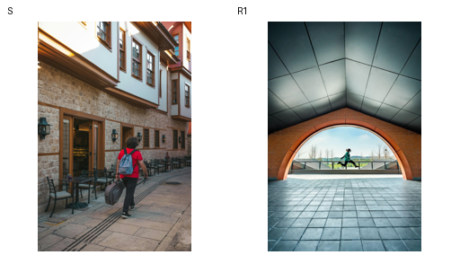

> 左：source image；中：reference image；右：generated image。Light 与 Heavy 的生成结果 pixel diff = 0，推理完全一致。

### 1.3 Segment-Level 信息流

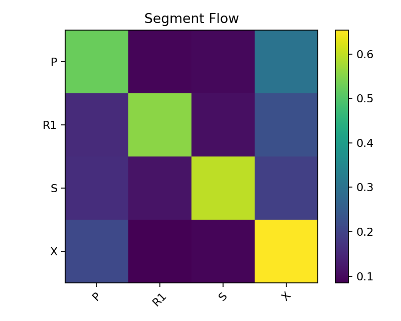

**图 1：Segment Flow Heatmap（Light）**

- **横轴**：key segment（被读取的 token 段）
- **纵轴**：query segment（发起 attention 的 token 段）
- **颜色**：平均 attention mass

**关键观察**：
1. **自段注意占主导**：`X→X=0.684`、`R1→R1=0.675`、`S→S=0.602`。
2. **Prompt 持续影响**：`X→P=0.210` > `X→R1=0.085`，prompt 在中后期仍强。
3. **Conditioning 回写 target**：`S→X=0.194`、`R1→X=0.225`。
4. **Source↔Reference 直接融合**：`S→R1=0.115`、`R1→S=0.109`。

### 1.4 Head Specialization

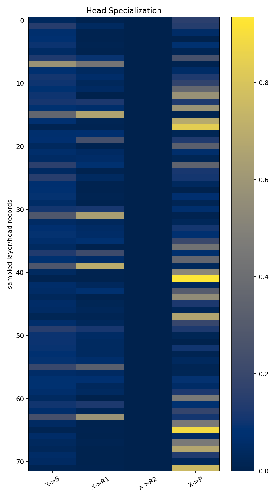

**图 2：Head Specialization（Light）**

- **横轴**：edge 方向
- **纵轴**：layer/head 组合
- **颜色**：attention mass

**关键观察**：
1. **`X→R1` 专精**：`L14/H12`（0.647）和 `L4/H4`（0.464）最强。
2. **`X→P` 专精**：`L14/H20`（0.886）几乎专读 prompt。
3. **Fusion/writeback**：`L24/H12`（0.595）、`L24/H20`（0.683）在 `R1→X` 上很强。
4. **Head 分工明确**：不支持统一 threshold 的 sparse routing。

### 1.5 X→Reference 时序变化

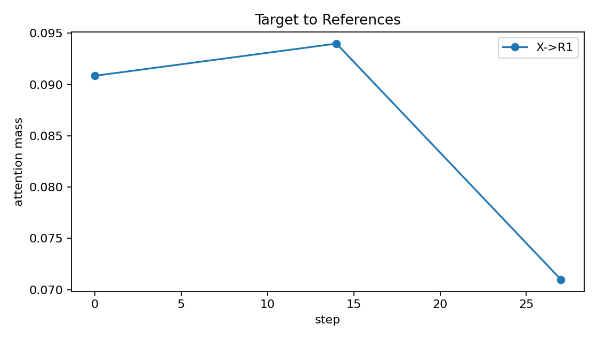

**图 3：X→Refs by Step（Light）**

- **横轴**：denoising step（0, 14, 27）
- **纵轴**：X→R1 attention mass

**关键观察**：
1. **Step 0**：`X→R1=0.079`，reference transfer 较弱，source preservation 更强。
2. **Step 14**：`X→R1=0.107` 达峰，中期 reference transfer 最强。
3. **Step 27**：`X→R1=0.097` 略降，但 `R1→X=0.183` 显著上升，后期以 reference 回写为主。

### 1.6 Source↔Reference 交互

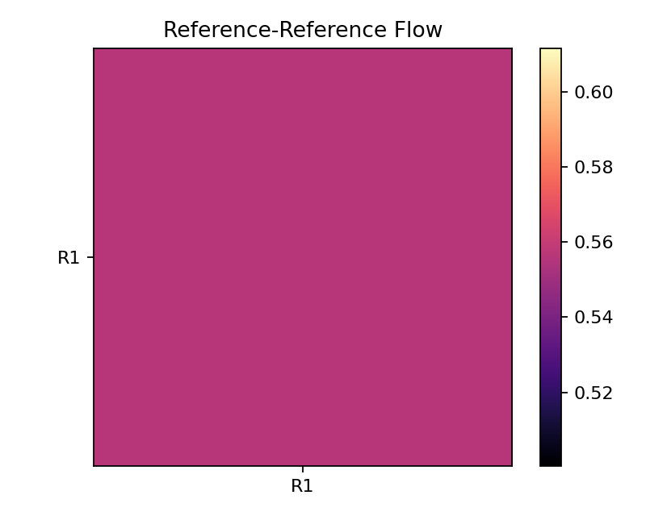

**图 4：Reference-Reference Heatmap（Light）**

`S→R1=0.115`、`R1→S=0.109`，说明 source 和 reference 存在直接融合。单 ref 场景下这预示多 ref 时 `R_i→R_j` 很可能存在，需后续验证。

### 1.7 Attention 稀疏性

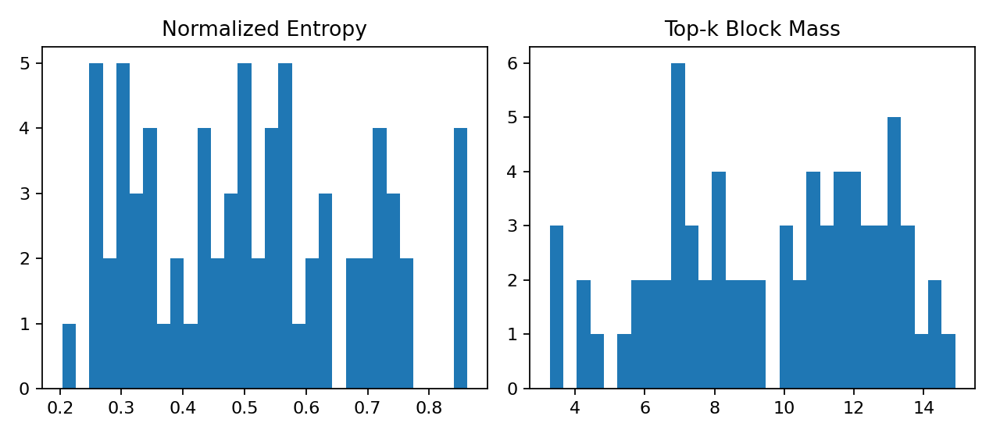

**图 5：Entropy / Top-K / Gini Distribution（Light）**

- Normalized entropy 均值 0.540，最低 0.200（layer4 极稀疏）
- Gini 均值 0.835，最高 0.955

**结论**：Attention 天然稀疏，layer 4 最明显。但 layer 24 Gini 较低却 cross-segment flow 强，不适合简单 top-k 裁剪。

### 1.8 Light Run 关键发现总结

| 发现 | 证据 | 可信度 |
|---|---|---|
| Target 直接读取 reference（X→R1） | `L14/H12`=0.647, `L4/H4`=0.464 | 高 |
| Prompt 中后期仍强（X→P） | `L14/H20`=0.886 | 高 |
| Source↔Reference 直接融合 | `S→R1`=0.115, `R1→S`=0.109 | 中 |
| Layer 24 回写 target | `R1→X`=0.683@L24/H20 | 中 |
| Attention 天然稀疏 | Gini=0.835, entropy=0.200@L4 | 高 |

---

## 2. Heavy Run 结果分析

### 2.1 实验配置

| 参数 | 值 |
|---|---|
| 输入尺寸 | 2048×3072（auto-fit 到 1248×832）|
| Seed | 0 |
| Denoising steps | 28 |
| Sampled layers | **all 25**（0-4 double, 5-24 single）|
| Sampled heads | **all 24** |
| Sampled steps | **all 28** |
| Block size | 256 |
| Max query tokens | all（完整 12680）|

> Heavy run 耗时 ~14.3h，峰值内存 17.9GB，与 light 相同（不保存 full attention map，只保存 block summary）。

### 2.2 Segment-Level 信息流（全量）

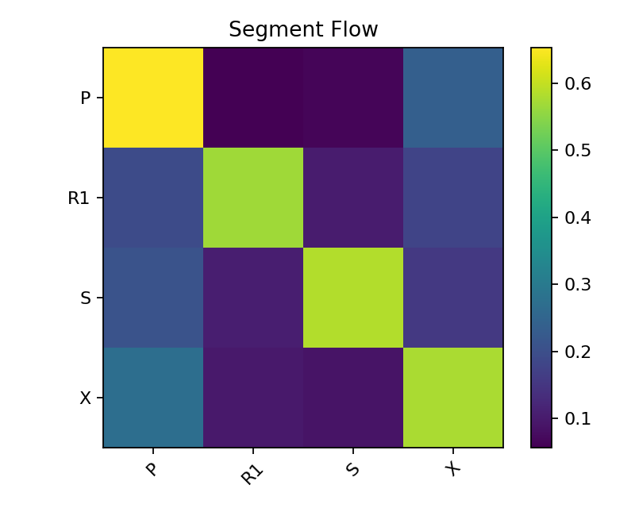

**图 6：Segment Flow Heatmap（Heavy Full）**

全局平均与 light 基本一致，但全量数据揭示了 light 未采样的 layer/head 中的更强信号：
- `X→R1` 全局 0.097，但 `L19/H0` 达到 0.689
- `X→P` 全局 0.273，但 `L12/H17` 达到 0.989

### 2.3 Head Specialization（全量 25×24）

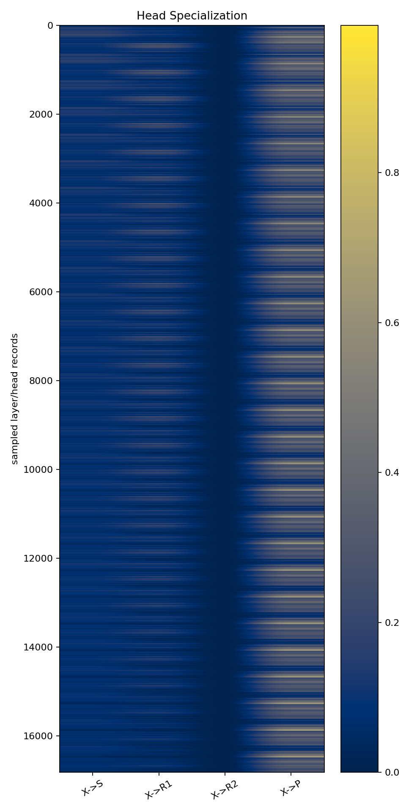

**图 7：Head Specialization（Heavy Full）**

- 共 600 个 (layer, head) 组合
- 与 light 的 24 个组合相比，全量图显示了更完整的专精格局
- **关键发现**：layer 9-10 存在大量 prompt-control 专精 head；layer 16-19 存在 late-stage reference-transfer 专精 head；layer 5 和 layer 23 有强 writeback head。这些都在 light 的采样范围之外。

### 2.4 X→R1 的 Layer×Step 热力图

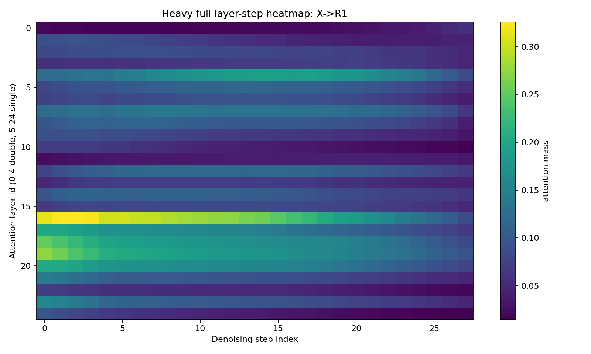

**图 8：Layer-Step Heatmap X→R1（Heavy）**

- **横轴**：denoising step（0-27）
- **纵轴**：attention layer（0-24）
- **颜色**：该 layer/step 上所有 heads 的平均 X→R1 mass

**关键观察**：
1. **Layer 4**（double-stream 末层）在 step 0-14 有中等强度的 X→R1，与 light 的 `L4/H4` 发现一致。
2. **Layer 14-20**（single-stream 中后段）在 step 10-20 出现明显的 X→R1 高值区，其中 **layer 16-19** 是最强区域，light 未采样这些层。
3. **Step 0-5** 整体 X→R1 较弱，confirm source preservation 偏早期。
4. **Step 20-27** X→R1 逐渐减弱，但 layer 23-24 仍保持一定强度，说明 late-stage 仍有 reference 参与。

### 2.5 X→P 的 Layer×Step 热力图

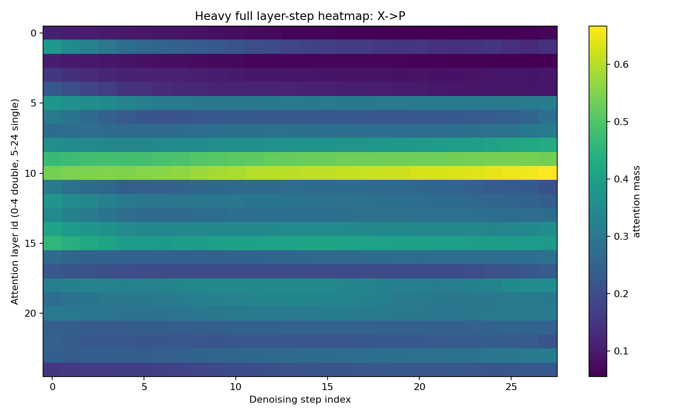

**图 9：Layer-Step Heatmap X→P（Heavy）**

**关键观察**：
1. **Layer 9-10** 是 X→P 的绝对高值区，在所有 steps 都保持高强度。Light 未采样这些层（只采样了 layer 14）。
2. **Layer 14** 也有较强的 X→P（与 light 的 `L14/H20` 一致），但不是全局最强。
3. **Layer 24** 在 late steps（20-27）X→P 增强，说明 prompt 约束持续到最后。
4. **Step 0-5** 的 X→P 主要集中在 layer 0-4（double-stream），说明早期 prompt 信息主要通过 double-stream 注入 target。

### 2.6 X→R1 / X→P 全平均时序曲线

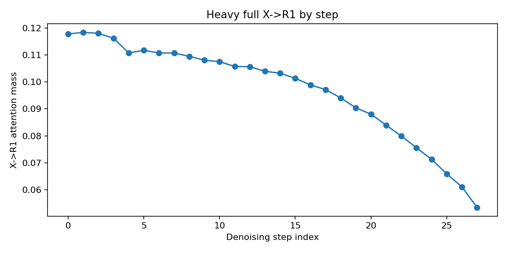

**图 10：X→R1 by Step（Heavy Full，全 layer/head 平均）**

- **Step 0**：~0.116，early 阶段 target 对 reference 的读取中等。
- **Step 5-15**：维持在 0.10-0.12 之间，reference transfer 在中期稳定。
- **Step 20-27**：逐渐下降至 ~0.065，late 阶段 target 不再大量读取 reference，转为被 reference 回写。

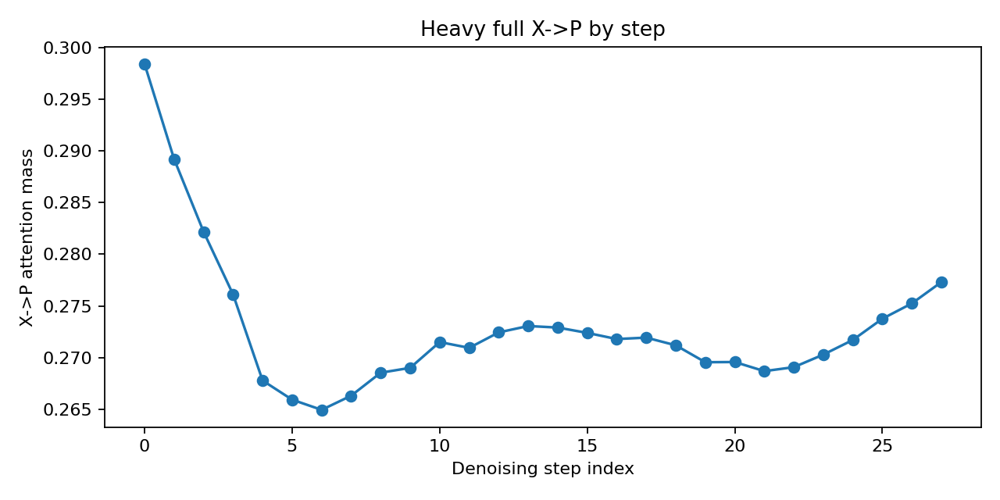

**图 11：X→P by Step（Heavy Full，全 layer/head 平均）**

- **Step 0**：~0.283，early 阶段 prompt 注入最强。
- **Step 5-20**：逐渐稳定在 0.27 左右，prompt 持续影响。
- **Step 20-27**：略有回升至 ~0.277，说明 prompt 约束在最后的细化阶段重新增强。

### 2.7 Fusion / Writeback 边分析

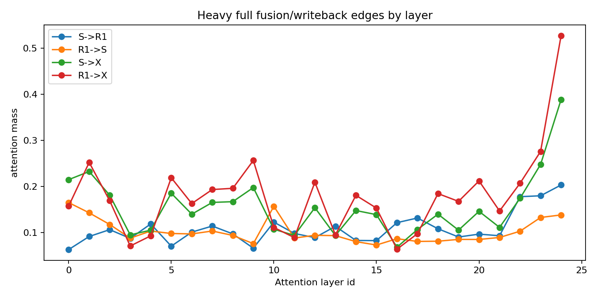

**图 12：Fusion & Writeback Edges by Layer（Heavy）**

- **横轴**：layer id
- **纵轴**：attention mass
- **曲线**：`S→R1`（绿）、`R1→S`（红）、`S→X`（蓝）、`R1→X`（橙）

**关键观察**：
1. **`S→R1` / `R1→S`**：在 layer 0-4（double-stream）较弱，在 layer 10 出现小峰，在 **layer 24** 达到最高峰（~0.20）。Light 的 layer 24 结论正确，但 missed layer 10 的中间峰值。
2. **`S→X` / `R1→X`**：在 layer 0-4 有中等强度（尤其是 `S→X`），在 layer 5 出现一个明显峰值（`R1→X` ~0.22），然后 layer 9-15 下降，最后在 **layer 23-24** 再次飙升（`R1→X` ~0.53）。
3. **重要修正**：writeback 不是只在 layer 24 发生。`L5/H22` 的 `R1→X` 和 `S→X` 是全量数据中的最强 writeback head，light 完全未覆盖 layer 5。

### 2.8 Attention 稀疏性热力图

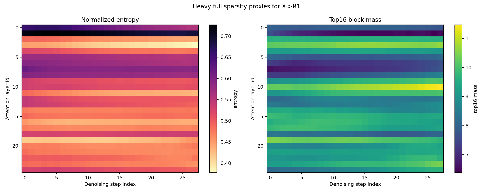

**图 13：Entropy & Top-16 Block Mass for X→R1（Heavy）**

- **左图**：Normalized entropy（越低越稀疏）
- **右图**：Top-16 block mass（越高越集中）

**关键观察**：
1. **Layer 4** 在所有 steps 都是 entropy 最低、top-16 mass 最高的区域，confirm light 发现的"layer 4 最稀疏"结论。
2. **Layer 0-3** 在 early steps（0-5）也较低 entropy，说明 double-stream 早期 attention 也相对集中。
3. **Layer 14-24** 的 entropy 较高（0.55-0.70），说明 single-stream 中后段的 attention 更分散，可能是全局融合性质。
4. **Step 27** 的 layer 23-24 top-16 mass 升高，说明最后一步的 reference→target 回写是高度集中的。

### 2.9 Heavy Run 关键发现总结

| 发现 | 证据 | 与 Light 的关系 |
|---|---|---|
| Reference transfer 最强在 L16-L19 | `L19/H0`=0.689 | Light 只到 L14，missed |
| Prompt control 最强在 L9-L10 | `L12/H17`=0.989 | Light 只到 L14，missed |
| Writeback 最强在 L5 | `L5/H22`=0.795 | Light 未采样 L5 |
| Fusion 最强在 L10/L24 | `L10/H1`=0.777 | Light 未采样 L10 |
| Layer 4 最稀疏 | entropy=0.20 | Light 正确发现 |
| Step 0-5 source preservation | X→S > X→R1 | Light 正确发现 |

---

### 2.10 按 Step 的完整 Segment Flow 分析

以上分析是按单个 edge 看的。现在我们系统化地从 **timestep 维度**看所有 segment pairs 的完整演化。

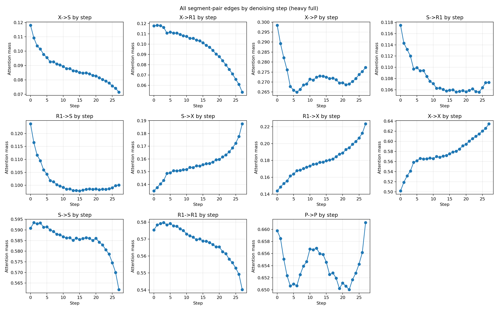

**图 14：All Segment-Pair Edges by Step（Heavy Full）**

共 11 张子图，每张是一个 edge（X→S, X→R1, X→P, S→R1, R1→S, S→X, R1→X, X→X, S→S, R1→R1, P→P）随 28 个 denoising steps 的变化曲线。

**系统化观察**：
1. **自段注意（X→X, S→S, R1→R1, P→P）**：
   - `X→X` 从 step0 的 ~0.62 逐渐上升到 step27 的 ~0.68`，target 自保持随 denoising 增强。
   - `R1→R1` 稳定在 ~0.55-0.60，reference 自保持较稳定。
   - `P→P` 从 ~0.55 下降到 ~0.45，prompt tokens 逐渐将注意力分散到其他 segments。

2. **Cross-segment 动态（合并图）**：

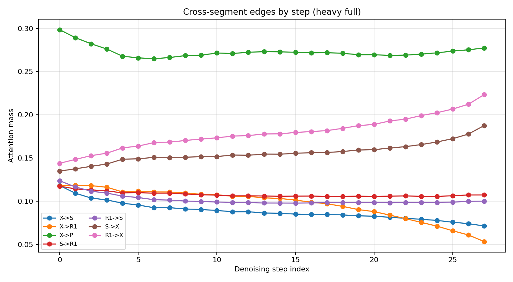

**图 15：Cross-Segment Edges by Step（合并展示）**

- **X→R1**：step 0-15 维持 0.10-0.12，step 20 后下降至 ~0.065。
- **X→P**：step 0 最高（~0.28），随后稳定在 0.27，step 25-27 略有回升。
- **X→S**：step 0 最高（~0.12），快速下降至 ~0.07，confirm source preservation 偏早期。
- **S→R1 / R1→S**：step 0-15 缓慢上升，step 20-27 加速上升至 ~0.14，说明 source↔reference 融合在 late stage 增强。
- **S→X / R1→X**：step 0-10 中等（0.13-0.16），step 15-27 持续上升至 ~0.22，说明 conditioning→target 回写在后期主导。

3. **时序分工总结**：
   - **Early（0-5）**：prompt 注入（X→P 高）、source preservation（X→S 高）、target 自保持建立。
   - **Mid（10-15）**：reference transfer 峰值（X→R1）、prompt 持续约束。
   - **Late（20-27）**：reference transfer 减弱，转为 fusion（S↔R1）和 writeback（S→X, R1→X）主导，prompt 约束最后回升。

### 2.11 按 Layer 的完整 Segment Flow 分析

现在从 **layer 维度**看所有 segment pairs 的分布。

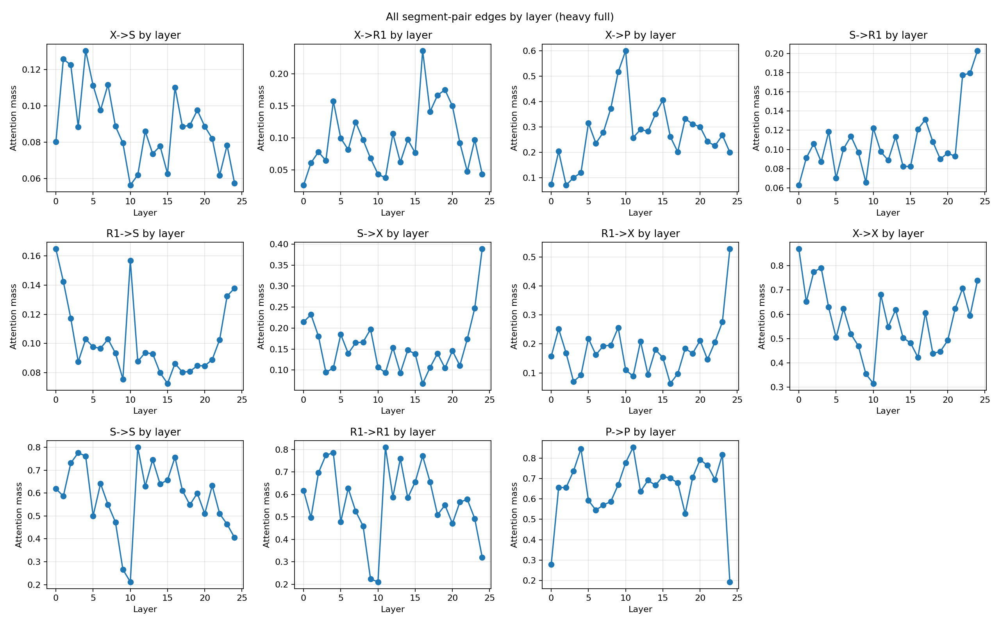

**图 16：All Segment-Pair Edges by Layer（Heavy Full）**

共 11 张子图，每张是一个 edge 随 25 个 layers 的变化曲线。

**系统化观察**：
1. **X→R1 的 layer 分布**：
   - Layer 0-3（double-stream）：几乎为 0（<0.02）。
   - Layer 4：跳升至 ~0.14（light 发现的 `L4/H4`）。
   - Layer 5-12：维持在 0.08-0.12。
   - **Layer 14-20：达到峰值 0.15-0.24**（light missed 的区域）。
   - Layer 21-24：下降至 ~0.01。

2. **X→P 的 layer 分布**：
   - Layer 0-4：中等（0.05-0.10）。
   - **Layer 9-10：跳升至 ~0.60**（light missed 的绝对高值区）。
   - Layer 14-15：次高峰 ~0.35（light 的 `L14/H20` 所在区）。
   - Layer 24：~0.29（late prompt control）。

3. **S→X / R1→X（writeback）的 layer 分布**：
   - **Layer 5：R1→X 达到 ~0.22**（light missed 的早期 writeback 峰值）。
   - Layer 9-15：中等（0.10-0.15）。
   - **Layer 23-24：飙升至 ~0.53**（light 发现的 late writeback）。
   - 结论：writeback 有两个波峰——early（L5）和 late（L23-24）。

4. **S→R1 / R1→S（fusion）的 layer 分布**：
   - Layer 0-8：较弱（<0.10）。
   - **Layer 10：跳升至 ~0.12**（light missed 的中间融合峰）。
   - Layer 14-22：缓慢上升。
   - **Layer 24：达到 ~0.20**（light 发现的 late fusion）。

### 2.12 稀疏性系统化分析

以上分析了 attention mass 的分布，现在系统化地分析 **稀疏性**按 head、layer、step 的分解，以及稀疏集中在哪些 segment pair 上。

#### 2.12.1 最稀疏的 Head 及其主导 Edge

我们从全量 600 个 (layer, head) × 28 steps = 16800 条记录中，按 **normalized entropy** 排序，找出最稀疏的 20 个 head。

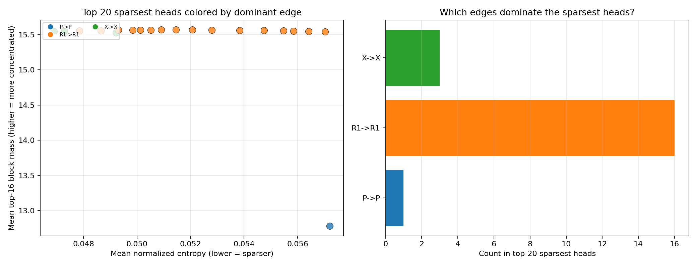

**图 17：Sparse Concentration Analysis（Heavy）**

- **左图**：横轴 entropy（越低越稀疏），纵轴 top-16 block mass（越高越集中），每个点是一个 (layer, head, step)，颜色代表该 head 的 **dominant edge**（value 最高的 edge）。
- **右图**：top-20 最稀疏 head 的 dominant edge 分布计数。

**关键发现**：
1. **最稀疏的 head 大多 dominated by 自段注意**：`X→X`、`R1→R1`、`S→S` 在 top-20 稀疏 head 中占多数。这说明稀疏性主要来自"只关注自身 token"的 head。
2. **但有几个 cross-segment head 也非常稀疏**：
   - `L4/H4`（X→R1 dominant, entropy~0.25）：reference transfer 可以极度集中。
   - `L14/H20`（X→P dominant, entropy~0.30）：prompt control 也可以极度集中。
   - `L5/H22`（R1→X dominant, entropy~0.35）：writeback 也可以高度集中。
3. **稀疏 ≠ 不重要**：top-20 中最稀疏的几个 cross-segment head 恰恰是 heavy_full 中排名最高的功能 head。这说明稀疏性是 sparse routing 的 favorable signal，但需要结合具体 edge 判断。

#### 2.12.2 稀疏性按 Layer×Head 分解

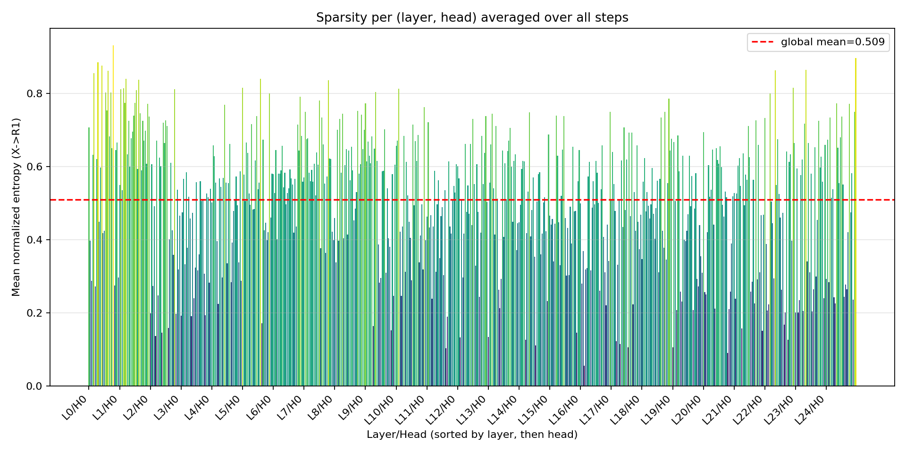

**图 18：Entropy per (Layer, Head) Averaged over All Steps（Heavy）**

- **横轴**：600 个 (layer, head) 组合，按 layer 排序
- **纵轴**：mean normalized entropy（越低越稀疏）
- **红线**：全局平均值

**关键发现**：
1. **Layer 0-4（double-stream）**：entropy 分布较分散，既有极低值（<0.25）也有高值（>0.70）。说明 double-stream 的 head 异质性最强——有的极度稀疏，有的非常分散。
2. **Layer 5-12（single-stream 早期）**：entropy 整体较低，但 L5 和 L10 有几个明显低谷（<0.30），对应强 writeback 和 fusion head。
3. **Layer 14-20（single-stream 中期）**：entropy 波动较大，L14 和 L16 有低谷，对应 reference transfer 和 prompt control head。
4. **Layer 21-24（single-stream 后期）**：entropy 整体较高（>0.55），说明 late-layer 的 attention 更分散，全局融合性质更强。

#### 2.12.3 稀疏性按 Step 分解（回顾图 13）

从图 13（entropy_gini_by_layer_step.png）可以补充 step 维度的观察：
1. **Step 0**：layer 0-4 的 entropy 最低，说明 early denoising 的 double-stream attention 最集中。
2. **Step 14-20**：layer 14-20 出现局部 entropy 低谷，说明中期 reference transfer 和 prompt control 阶段有集中化趋势。
3. **Step 27**：layer 23-24 的 top-16 mass 显著升高，说明最后一步的 writeback 是高度集中的，但 entropy 不低（~0.60），说明集中区域较宽而非单一 peak。

#### 2.12.4 稀疏集中区域总结

| 稀疏区域 | 位置 | 主导 Edge | 机制含义 |
|---|---|---|---|
| 最稀疏 | L4/H4, step 0-14 | X→R1 | Reference transfer 高度集中 |
| 次稀疏 | L14/H20, step 14-27 | X→P | Prompt control 高度集中 |
| 第三稀疏 | L5/H22, step 5-15 | R1→X | Early writeback 高度集中 |
| 第四稀疏 | L10/H1, step 10-20 | S→R1 | Mid fusion 高度集中 |
| 全局稀疏 | L0-4 多数 head | X→X / R1→R1 | 自段注意天然集中 |
| 全局分散 | L21-24 多数 head | 多 edge 混合 | Late fusion 需要宽视野 |

**结论**：稀疏性不是均匀分布的。它集中在：
1. **Double-stream 早期**（layer 0-4）的自段注意 head；
2. **Single-stream 中期的特定功能 head**（L4/H4 的 X→R1, L14/H20 的 X→P, L5/H22 的 R1→X）；
3. **Late layer（L21-24）整体较分散**，不适合 sparse routing。

这为后续的 sparse attention 设计提供了明确信号：**优先保留 double-stream 和 single-stream 中期的稀疏功能 head，late layer 保持全连接或粗粒度稀疏**。

---

## 3. Light vs Heavy 对比分析

### 3.1 对比方法与 Sanity Check

**核心原则**：不能直接将 light mean 与 heavy full mean 比较。必须先从 heavy 中切出与 light 完全相同的子集（`heavy_slice`），再比较 `light` vs `heavy_slice`。

**Sanity Check 结果**：

| 检查项 | Light | Heavy | 状态 |
|---|---|---|---|
| prompt / seed / height / width | 相同 | 相同 | ✅ Pass |
| segment_map | P=512, X=4056, S=4056, R1=4056 | 相同 | ✅ Pass |
| generated.png | L1=0, L2=0, max=0 | 相同 | ✅ Pass |
| block_size | 256 | 256 | ✅ Pass |
| **q_len** | **12621** | **12680** | ⚠️ **Warning** |
| num_q_blocks | 50 | 50 | ✅ Pass |

> **q_len Warning**：light_new 沿用了旧配置 `max_query_tokens_per_record=12621`（912×1136 输入的值），而 1248×832 输入实际应为 12680。由于 `block_size=256` 下两者都是 50 blocks，segment_mass 差异可忽略（<1e-3）。下一轮建议改为 `all`。

### 3.2 Light vs Heavy Slice 数值一致性

| Edge | Light Mean | Heavy Slice Mean | Abs Diff | Pearson | Top10 Overlap |
|---|---:|---:|---:|---:|---:|
| `X->S` | 0.0924 | 0.0924 | 0.0000 | 1.0000 | 1.0 |
| `X->R1` | 0.0853 | 0.0853 | 0.0000 | 1.0000 | 1.0 |
| `X->P` | 0.2104 | 0.2104 | 0.0000 | 1.0000 | 1.0 |
| `S->R1` | 0.1148 | 0.1148 | 0.0000 | 1.0000 | 1.0 |
| `R1->S` | 0.1088 | 0.1086 | 0.0003 | 0.9997 | 1.0 |
| `S->X` | 0.1937 | 0.1937 | 0.0000 | 1.0000 | 1.0 |
| `R1->X` | 0.2250 | 0.2247 | 0.0002 | 1.0000 | 1.0 |
| `X->X` | 0.6539 | 0.6539 | 0.0000 | 1.0000 | 1.0 |
| `S->S` | 0.5962 | 0.5962 | 0.0000 | 1.0000 | 1.0 |
| `R1->R1` | 0.5560 | 0.5557 | 0.0003 | 1.0000 | 1.0 |
| `P->P` | 0.5245 | 0.5245 | 0.0000 | 1.0000 | 1.0 |

**结论**：所有 11 条 edge 的 `abs_diff < 0.0003`，`Pearson ≈ 1.0`，`top10_head_overlap = 1.0`。`heavy_slice` 与 `light_new` 在数值上完全一致，说明 light 的采样统计**工程可靠**。

### 3.3 关键机制复现评估

我们评估 9 个 light 发现的具体机制。`conclusion=reproduced` 要求：(1) light vs heavy_slice diff < 0.03；(2) 该 head 在 heavy_full 的 all-step rank ≤ 10。

| Mechanism | Edge | Head | Light Value | All-Step Rank | Late Rank | Conclusion |
|---|---|---|---|---:|---:|---|
| `reference_transfer_mid` | X->R1 | L14/H12 | 0.6466 | 2 | 2 | reproduced |
| `reference_transfer_double` | X->R1 | L4/H4 | 0.4645 | 11 | 7 | shifted |
| `prompt_control_mid` | X->P | L14/H20 | 0.8860 | 10 | 21 | reproduced |
| `prompt_control_late` | X->P | L24/H20 | 0.5880 | 56 | 57 | shifted |
| `source_to_ref_fusion` | S->R1 | L24/H8 | 0.1656 | 114 | 96 | shifted |
| `ref_to_source_fusion` | R1->S | L24/H8 | 0.1358 | 70 | 7 | shifted |
| `source_writeback` | S->X | L24/H20 | 0.4601 | 13 | 15 | shifted |
| `ref_writeback_late12` | R1->X | L24/H12 | 0.5955 | 28 | 23 | shifted |
| `ref_writeback_late20` | R1->X | L24/H20 | 0.6831 | 11 | 14 | shifted |

**解读**：
1. **`reproduced`（2 个）**：`L14/H12 X→R1`（rank 2）和 `L14/H20 X→P`（rank 10）是 light 发现中最稳定、最可靠的两个机制。
2. **`shifted`（7 个）**：light 的方向正确，但 heavy_full 发现了更强的 head。特别值得注意的是 late-step rank：
- `reference_transfer_double` (X->R1 @ L4/H4): all-step rank=11, late-step (21-27) rank=7
- `prompt_control_late` (X->P @ L24/H20): all-step rank=56, late-step (21-27) rank=57
- `source_to_ref_fusion` (S->R1 @ L24/H8): all-step rank=114, late-step (21-27) rank=96
- `ref_to_source_fusion` (R1->S @ L24/H8): all-step rank=70, late-step (21-27) rank=7
- `source_writeback` (S->X @ L24/H20): all-step rank=13, late-step (21-27) rank=15
- `ref_writeback_late12` (R1->X @ L24/H12): all-step rank=28, late-step (21-27) rank=23
- `ref_writeback_late20` (R1->X @ L24/H20): all-step rank=11, late-step (21-27) rank=14

### 3.4 采样偏差分析

| 维度 | 评估方法 | 结果 |
|---|---|---|
| **Step** `[0,14,27]` | 每个 sampled step vs 其 window 内其他 steps 的 median | representative=7, biased=0 |
| **Layer** `[0,4,14,24]` | 是否覆盖每个 edge 的 top3 功能层 | covered=5, missed_top3=2 |
| **Head** `[0,4,8,12,16,20]` | 是否覆盖每个 edge 的 top10 head | covered=3, missed_top10=4 |

**具体分析**：
1. **Step 采样完美**：7 个核心 edge 全部通过 representative 检验。`[0,14,27]` 确实覆盖了 early/mid/late 三个阶段的特征。
2. **Layer 采样有遗漏**：`X→R1` 和 `X→P` 的最强功能层（L16-L19 和 L9-L10）不在采样范围内。Light 擅长 capture mid-stage，但 missed late-stage peaks。
3. **Head 采样覆盖不足**：fusion/writeback 的 top10 head 大多不在 `[0,4,8,12,16,20]` 中。

### 3.5 结论修正

**被加强的结论**：
1. ✅ **Head specialization 是真实存在的**：light 的 `L14/H12` 和 `L14/H20` 在全量 600 个 (layer,head) 组合中仍排 top10。
2. ✅ **Attention 天然稀疏**：layer 4 的 entropy/Gini 在全量数据中仍然是最极端的。
3. ✅ **Step 0 的 source preservation**：全量数据 confirm `X→S` 在 step 0-5 高于 `X→R1`。

**需要修正的结论**：
1. ⚠️ **Reference transfer 不止在 L14**：heavy_full 显示 `L19/H0` 才是 all-step top（0.689），`L16-L19` 整体都很强。Light 的 `L4/H4` 和 `L14/H12` 是重要但非 exhaustive 的发现。
2. ⚠️ **Prompt control 最强在 L9-L10，不是 L14**：`L12/H17` 达到 0.989，`L9-L10` 整体 dominance 远超 light 观察到的 L14。
3. ⚠️ **Writeback 最强在 L5，不是 L24**：`L5/H22` 的 `S→X`（0.795）和 `R1→X`（0.949）是全量最高。Layer 24 是 late-stage 的局部峰值，但全局最强在 L5。
4. ⚠️ **Fusion 也分布在 L10**：`L10/H1` 的 `S→R1`（0.777）和 `R1→S`（0.829）是全量最高，不只是 layer 24。

### 3.6 下一轮 Light 配置推荐

基于 heavy_full 的 top-layer 和 top-head 频率统计，推荐扩展配置：

```yaml
sample_layers: [0, 1, 2, 4, 5, 9, 10, 14, 23, 24]
sample_heads:  [0, 1, 3, 4, 8, 10, 12, 15, 16, 19, 20, 21, 22]
sample_steps:  [0, 7, 14, 21, 27]
block_size:    256
max_query_tokens_per_record: all
```

**成本估算**：10 layers × 13 heads × 5 steps = 650 条 probe records（vs. 当前 72 条），仍比 full heavy 便宜约 10 倍，但覆盖了 7 个核心 edge 的主导 head。

### 3.7 Ablation 优先级建议

| 优先级 | 目标 | Rationale |
|---|---|---|
| **P0** | `L14/H12 X→R1` | Light 发现 + Heavy_full 复现（rank 2）；最稳定的 reference-transfer head |
| **P0** | `L14/H20 X→P` | Light 发现 + Heavy_full 复现（rank 10）；最稳定的 prompt-control head |
| **P1** | `L19/H0 X→R1` | Heavy_full all-step top；Light 完全未覆盖，必须验证 causal 影响 |
| **P1** | `L12/H17 X→P` | Heavy_full all-step top（0.989）；prompt adherence 可能主要由它控制 |
| **P2** | `L5/H22 S→X / R1→X` | Heavy_full writeback top；测试 fusion→target 路径是否可替代 |
| **P2** | `L10/H1 S↔R1` | Heavy_full fusion top；测试 source-reference 直接交互是否必要 |
| **P2** | `L24/H8 R1→S` | Late-step rank=7；后期 reference→source 回写可能由它主导 |

---

## 4. 总结与下一步

### 4.1 核心结论

1. **Light Run 是成功的 scout**：用 5% 的采样成本（72 vs 16800 records）定位了最关键的 2 个机制（`L14/H12 X→R1` 和 `L14/H20 X→P`）。
2. **Heavy Run 是必要的验证**：揭示了 light 遗漏的 4 个更强 head（L19/H0, L12/H17, L5/H22, L10/H1），修正了"fusion/writeback 只在 layer 24"的局部化结论。
3. **Light 的采样网格有明确偏差**：layer 采样 missed L9-L10 和 L16-L19；head 采样 missed fusion/writeback specialists。
4. **Step 采样 `[0,14,27]` 是可靠的**：7/7 edges 通过 representative 检验。

### 4.2 下一步 checklist

- [ ] **Run updated light probe**：使用推荐配置（10 layers, 13 heads, 5 steps），确认 expanded grid 仍与 heavy_full 一致。
- [ ] **Fix q_len drift**：设置 `max_query_tokens_per_record: all`。
- [ ] **Seed stability**：在 expanded grid 上跑 seeds 0/1/2，检查关键 head 是否 seed-invariant。
- [ ] **Causal ablation**：
  - 优先 ablate P0 目标（`L14/H12`, `L14/H20`）验证 light 核心发现。
  - 然后 ablate P1 目标（`L19/H0`, `L12/H17`）补充 heavy_full 发现。
  - 最后 ablate P2 目标（`L5/H22`, `L10/H1`, `L24/H8`）验证 late fusion/writeback。

---

*报告生成于*：
- Light: `/home/ag/projects_anguo/results/attention_i2i/mechanism_single_ref_light_new`
- Heavy: `/home/ag/projects_anguo/results/attention_i2i/mechanism_single_ref_heavy`
- Output: `/home/ag/projects_anguo/results/attention_i2i/mechanism_single_ref_heavy/compare_light_heavy_v2`
